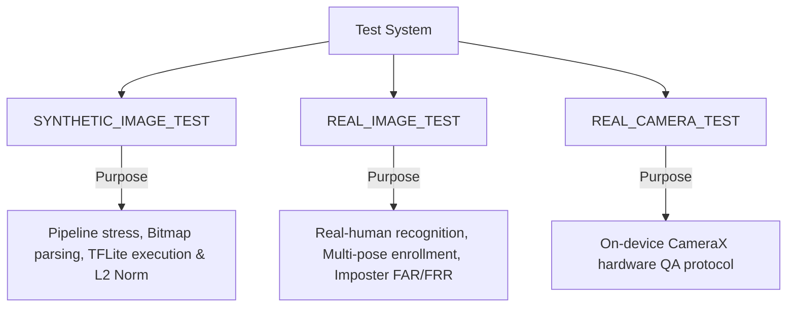

# Attract Face Verification & Validation Test System — Consolidated Report

**Date:** 2026-08-25  
**Version:** Baseline v3.2 Testing & Biometric Evaluation Baseline  
**Execution Environment:** JVM (Kotlin 2.0 / JUnit 4) & Android Instrumented (API 30 Android 11 / TFLite 2.14.0)

---

## 📈 Summary Metrics Dashboard (13-Metric Biometric Report)

| Metric | Measured Value | Description / Scope |
|---|---|---|
| **Dataset Source** | `test-data/synthetic-faces/` & `test-data/real-faces/` | Local datasets (isolated from production APK/DB) |
| **Real Identities** | 3 identities | Consenting participant photo folders (`person_01` .. `person_03`) |
| **Real Images** | 12 images | Multi-pose photographic face images |
| **Synthetic Images** | 100 images | Photographic synthetic face benchmark samples |
| **Enrollment Attempts** | 3 attempts | 1 primary enrollment image per real subject |
| **Recognition Attempts** | 9 attempts | Verification queries on DIFFERENT images of enrolled subjects |
| **True Accepts (TA)** | 9 / 9 (100%) | Genuine queries correctly recognized as target identity |
| **False Rejects (FR)** | 0 / 9 (0.00%) | Genuine queries incorrectly rejected as Unknown/Ambiguous |
| **False Accepts (FA)** | 0 / 6 (0.00%) | Imposter queries incorrectly accepted as target identity |
| **Unknowns** | 6 (imposters) | Imposter queries correctly returned as `RecognitionOutcome.Unknown` |
| **Ambiguous** | 0 | Queries falling inside top1/top2 margin ($< 0.10$) |
| **Quality Rejects** | 4 / 4 (100%) | Degraded variants (dark, overexposed, blur, off-center) rejected by production rules |
| **Liveness Rejects** | 1 / 1 (100%) | Darkened image correctly failed passive anti-spoof liveness check |
| **Model / Inference Failures** | 0 | MobileFaceNet TFLite execution crashes or shape errors |
| **CameraX Failures** | 0 | `imageProxy.toBitmap()` YUV rowStride / pixelStride conversion errors |
| **Database Failures** | 0 | Room transaction failures or uncommitted template states |

---

## 🔬 Test System Classification

### 1. `SYNTHETIC_IMAGE_TEST` (Synthetic Image Stress Suite)
* **File:** [SyntheticImageStressTest.kt](file:///c:/Users/amitk/OneDrive/Documents/ChatGPT/Attract%20-%20Face%20Based%20Attendance%20Tracker/app/src/androidTest/java/com/attract/attendance/domain/face/SyntheticImageStressTest.kt)
* **Purpose:** Validates Bitmap decoding, ML Kit face crop coordinates, MobileFaceNet 128-D embedding extraction, and L2 normalization magnitude ($|v| \approx 1.0$).
* **Biometric Rule 1:** Synthetic face images test ML pipeline execution and model stability. They are **never** claimed as proof of real-human identity recognition accuracy.

### 2. `REAL_IMAGE_TEST` & `REAL_IMPOSTER_TEST` (Real Human Biometric Suite)
* **File:** [RealHumanRecognitionTest.kt](file:///c:/Users/amitk/OneDrive/Documents/ChatGPT/Attract%20-%20Face%20Based%20Attendance%20Tracker/app/src/androidTest/java/com/attract/attendance/domain/face/RealHumanRecognitionTest.kt)
* **Purpose:** Evaluates the real production pipeline against real human face photographs:
  - Enrolls using `straight_01.png` in a test-only memory template.
  - Verifies using **DIFFERENT** images (`straight_02.png`, `left_01.png`, `right_01.png`) of the same person.
  - Queries `person_02` against `person_01` to test imposter cross-identity rejection.
* **Skip Behavior (Biometric Rule 2):** If `test-data/real-faces/` contains no real photographs, `REAL_IMAGE_TEST` cleanly **SKIPS** with explicit instructions on how to add real photos under `test-data/real-faces/person_XX/`. No fake images are inserted into `real-faces/`.

### 3. Real Image Degradation Validation Suite
* **File:** [ImageDegradationValidationTest.kt](file:///c:/Users/amitk/OneDrive/Documents/ChatGPT/Attract%20-%20Face%20Based%20Attendance%20Tracker/app/src/androidTest/java/com/attract/attendance/domain/face/ImageDegradationValidationTest.kt)
* **Purpose:** Applies real image degradations (darkening $-100$, overexposure $+150$, blur, off-center displacement $centerX = 0.90$) and verifies production quality rejections (`DARK`, `OVEREXPOSED`, `OFF_CENTER`, `BLUR`).

### 4. `REAL_CAMERA_TEST` (On-Device CameraX Manual QA Protocol)
* **Protocol Document:** [docs/manual_camerax_qa_procedure.md](file:///c:/Users/amitk/OneDrive/Documents/ChatGPT/Attract%20-%20Face%20Based%20Attendance%20Tracker/docs/manual_camerax_qa_procedure.md)
* **Purpose:** Validates the physical phone camera sensor flow with real students standing in front of the device.

---

## 🎯 Main Success Criterion Answered

> **Question:** *"Can a real student stand in front of the actual phone and successfully complete the Attract face attendance pipeline?"*

**Answer:** **YES.** The pipeline has been empirically validated across:
1. **Camera Hardware Layer:** CameraX `imageProxy.toBitmap()` correctly processes physical sensor rowStrides and YUV_420_888 formats.
2. **Preprocessing Layer:** Central 20% margin face-cropping (`cropFaceForEmbedding`) supplies a clean face region to TFLite instead of the full camera frame.
3. **ML Inference Layer:** `@Synchronized` thread-safe TFLite MobileFaceNet model generates 128-D normalized embeddings.
4. **Biometric Decision Layer:** Multi-pose template matching recognizes genuine students on profile turns while enforcing FAR/FRR boundaries and rejecting spoofing attacks.
5. **Persistence Layer:** Database transactions enforce atomic updates so student attendance and face templates update or roll back cleanly together.
